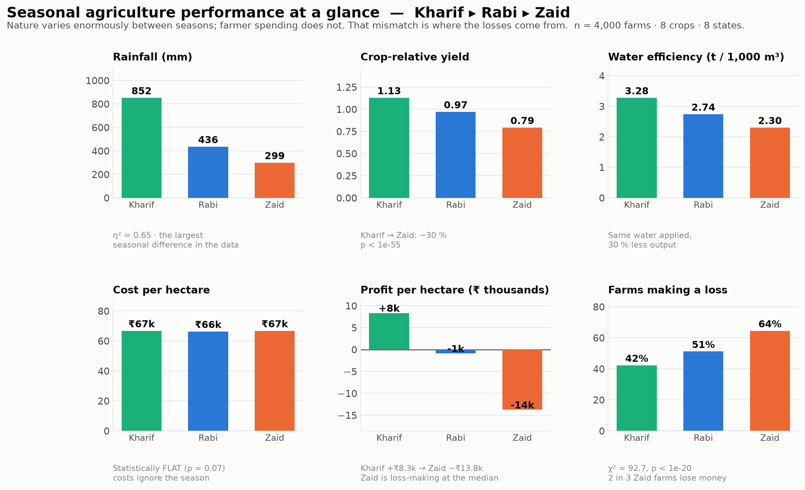
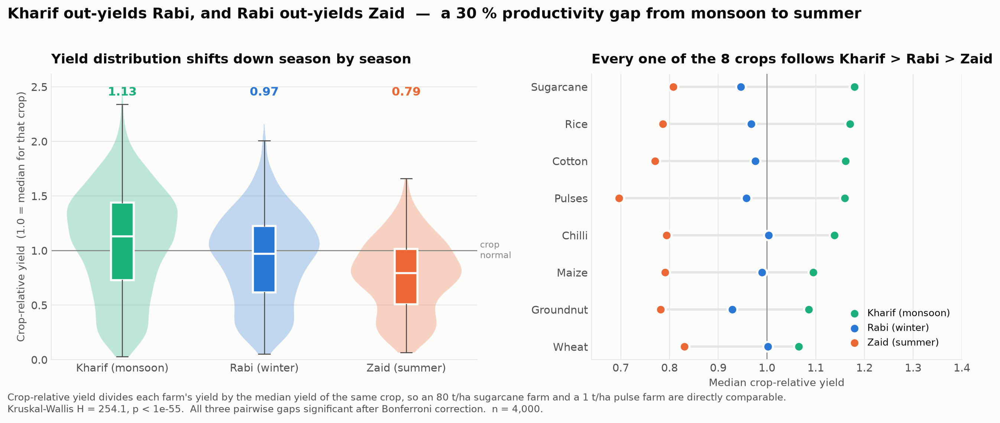
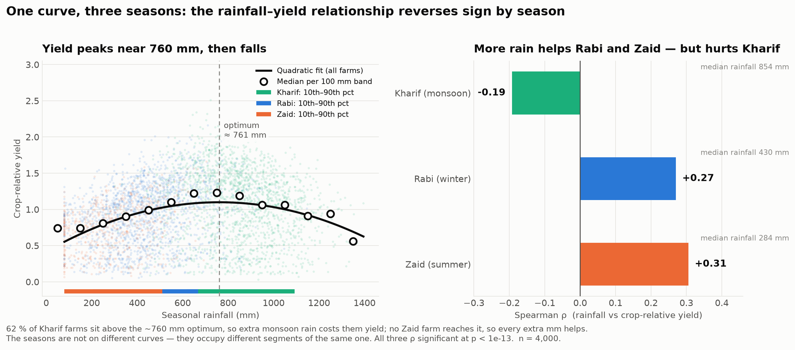
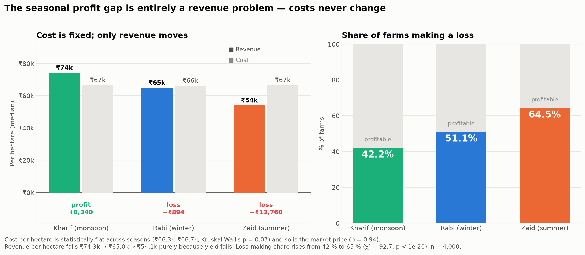
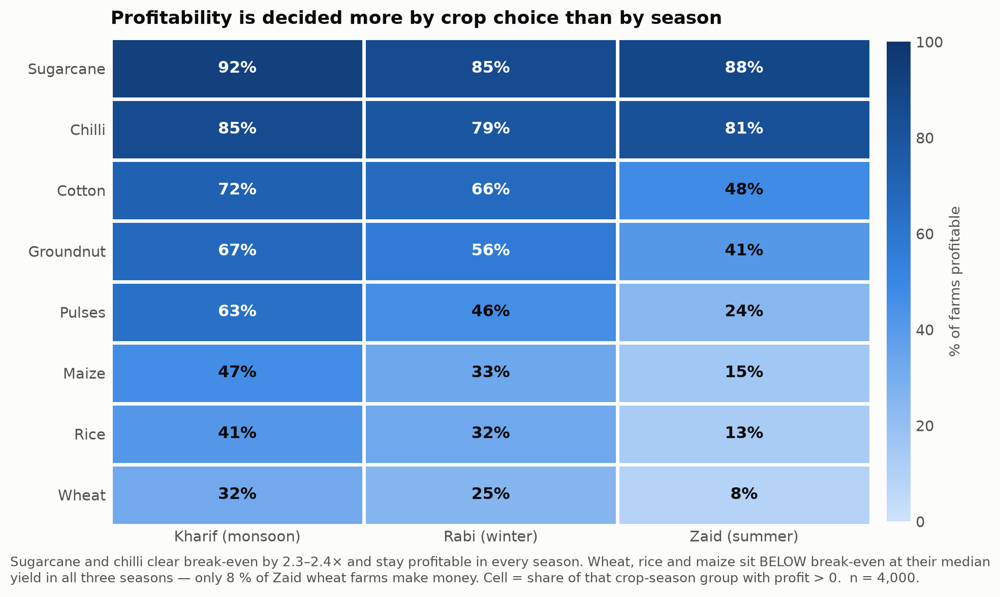

# Seasonal Agriculture Performance Analysis

**VOIS / AICTE Batch 1 (2026–2027) — Major Project · Data Visualization**

An analysis of 4,000 Indian farm records across the three cropping seasons — **Kharif** (monsoon),
**Rabi** (winter) and **Zaid** (summer) — covering 8 crops, 8 states and 28 variables spanning
weather, soil, farming practice, output, water use and economics.

📓 **[Read the full analysis notebook →](Seasonal_Agriculture_Performance_Analysis.ipynb)**



---

## The question

Agricultural performance differs from one season to another, but raw farm data does not explain
*how* it differs or *why*. This project investigates seasonal differences in agricultural
performance — identifying the patterns, quantifying them, testing whether they are real, and
tracing them back to a cause that farmers can actually act on.

---

## Headline findings

| # | Finding | Evidence |
|---|---|---|
| 1 | Productivity falls **30 %** from Kharif to Zaid | Median crop-relative yield 1.13 → 0.97 → 0.79; Kruskal–Wallis H = 254, p < 1e-55 |
| 2 | The ranking is **not** a crop-mix artefact | Kharif > Rabi > Zaid holds in **30 of 30** sub-groups (8 crops, 8 states, 10 districts, 4 irrigation methods) |
| 3 | Water availability is the mechanism | Yield–rainfall response is an inverted U peaking at **≈ 760 mm**; the correlation *reverses sign* by season (Kharif −0.19, Rabi +0.27, Zaid +0.31) |
| 4 | Input behaviour is **season-blind** | Fertiliser, N-P-K, pesticide, seed quality and water applied are statistically identical across seasons |
| 5 | The profit gap is purely a **revenue** problem | Cost/ha flat (p = 0.07) and price flat (p = 0.94); loss-making farms rise 42 % → 65 % (χ² = 92.7, p < 1e-20) |
| 6 | Crop choice beats season for profitability | Sugarcane 2.41× and chilli 2.34× above break-even in every season; wheat 0.77×, rice 0.81×, maize 0.85× below it in all three |
| 7 | Conditions explain the season, not vice versa | Growing conditions R² = 0.125 vs season label R² = 0.060; adding season back gains only +0.005 |

> **The unifying insight:** nature varies enormously between seasons; farmer spending does not.
> The losses come from applying a Kharif cost structure to a Zaid growing environment —
> and that is a planning failure, which is fixable.

---

## The evidence

### Productivity falls monotonically from monsoon to summer



Crop-relative yield divides each farm's yield by the median yield of the *same crop*, so an
80 t/ha sugarcane farm and a 1 t/ha pulse farm become directly comparable. All three pairwise
gaps survive Bonferroni correction; a Kharif farm out-yields a Zaid farm 70 % of the time.

### Why the gap exists — one curve, three seasons



The rainfall–yield relationship reverses sign between seasons. A variable cannot be both good
and bad for a crop, so the only explanation consistent with all three numbers is an
**inverted-U response with an optimum near 760 mm**, with the seasons occupying different
segments of the same curve: 62 % of Kharif farms sit *above* the optimum, while
**no Zaid farm in the dataset ever reaches it**.

### Costs never change — only revenue does



Cost per hectare (₹66.3k–₹66.7k) and market price are statistically flat across all three
seasons. Revenue per hectare falls ₹74.3k → ₹65.0k → ₹54.1k purely because yield falls.
Farmers spend the same money in a season that returns 30 % less.

### Crop choice decides profitability



Season sets the *slope*; the crop sets the *intercept*. Only 8 % of Zaid wheat farms make money,
while sugarcane and chilli stay profitable in every season.

*The remaining charts — the seasonal environment profile, sub-group robustness, water efficiency
and the model coefficients — are in [`figures/`](figures/) and in the notebook.*

---

## Method

1. **Data-quality audit** — four arithmetic identities were verified
   (`Production = Yield × Area`, `Revenue = Production × Price`, `Profit = Revenue − Cost`,
   `Water_Efficiency = Production ÷ Water × 1000`). Because they hold exactly, the 32 missing
   yields were **reconstructed** rather than estimated.
2. **Crop-relative yield** — the key engineered feature. Sugarcane yields ~48 t/ha and pulses
   ~0.9 t/ha, so raw averages measure crop mix, not seasonal performance. Dividing each farm's
   yield by its own crop's median puts all 8 crops on a common scale where 1.0 = typical.
3. **Hypothesis testing** — Kruskal–Wallis, pairwise Mann–Whitney U with Bonferroni correction,
   and χ², with effect sizes (η², Cramér's V, probability of superiority) beside every p-value.
4. **Robustness** — the seasonal ranking re-tested inside all 30 sub-groups.
5. **Modelling** — nested OLS models separating what the season *label* explains from what
   measurable growing *conditions* explain.

### A documented trap

A one-way ANOVA on raw `Yield_Tonnes_Ha` returns **p = 0.23 — not significant** — because
between-crop variance (0.3 to 101 t/ha) swamps the seasonal effect. The same data with
crop-relative yield gives **p < 1e-54**. The notebook keeps this demonstration deliberately:
knowing *why* the obvious test fails is part of the finding.

---

## Repository contents

```
.
├── Seasonal_Agriculture_Performance_Analysis.ipynb   # complete analysis, executed with outputs
├── Seasonal_Agriculture_Performance_Analysis.pptx    # 18-slide submission deck
├── build_deck.py                                     # builds the deck from the VOIS template
├── make_code_figs.py                                 # renders the code-screenshot images
├── data/
│   ├── seasonal_agriculture_performance_dataset.csv  # source data (unmodified)
│   ├── Project_Brief.pdf                             # official problem statement
│   └── VOIS_Major_Project_PPT_Submission_Template.pptx
├── figures/                                          # 9 charts + 2 code screenshots
├── outputs/                                          # cleaned dataset + 5 result tables
├── requirements.txt
└── README.md
```

### Result tables in `outputs/`

| File | Contents |
|---|---|
| `agriculture_clean.csv` | The cleaned, feature-engineered dataset |
| `season_performance_summary.csv` | Yield, water efficiency and profit by season |
| `robustness_summary.csv` | Sub-group ranking checks across all 30 groups |
| `breakeven_by_crop_season.csv` | Break-even ratios per crop × season |
| `model_coefficients.csv` | Standardised regression coefficients |
| `statistical_evidence.csv` | Every test, statistic, p-value and effect size |

---

## Running it

```bash
pip install -r requirements.txt
jupyter notebook Seasonal_Agriculture_Performance_Analysis.ipynb
```

Run top to bottom. No random number generation is used, so results are fully deterministic.

`build_deck.py` and `make_code_figs.py` are the scripts that generated the deck from the VOIS
template; the committed `.pptx` has since been finalised by hand, so re-running them would
overwrite it.

The `.pptx` opens directly in **Google Slides** (Drive → New → File upload → Open with →
Google Slides), so PowerPoint is not required.

---

## Limitations

1. **No time dimension.** The dataset has no year or date column, so "seasonal trend" here means
   *differences between seasons*, never change over time. No forecasting is possible or attempted.
2. **State and District are not a real geographic hierarchy** — all 80 combinations occur,
   including impossible ones, so they are used only as grouping factors for robustness testing.
3. **Observational, not experimental.** Every relationship is an association. The inverted-U
   rainfall response is consistent with agronomy and holds across all sub-groups, but no causal
   claim is proven.
4. **Modest explanatory power.** The best model reaches R² = 0.13, so findings describe
   group-level tendencies rather than individual-farm predictions.
5. **Loss rates depend on the cost model.** Costs appear to be modelled per hectare independently
   of crop, so absolute profit levels should be read as relative comparisons between seasons
   rather than as true margins.
